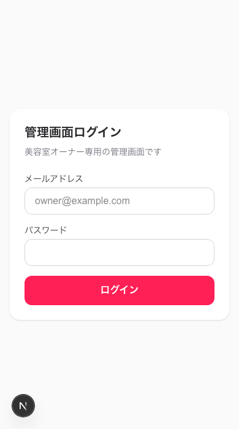

# 美容室向け LINE Bot + AI 自動応答システム

美容室の LINE 公式アカウントに届いた質問に、登録済みの FAQ・メニュー情報だけを根拠に AI が自動返信するシステムです。AI が自信を持って答えられない質問は、オーナーへ LINE 通知のうえ管理画面でエスカレーション管理し、誤情報の送信を防ぎます。

**公開 URL**: https://salon-line-bot-ai.vercel.app



## 主な機能

- **AI 自動応答** — Claude API が FAQ・メニュー情報のみを根拠に回答を生成。登録にない内容は推測せず、確信度が低い場合は自動回答しない
- **エスカレーション** — AI が回答できない質問は、オーナーへ LINE 通知 + 管理画面の「要対応」一覧に記録
- **管理画面（スマホファースト）** — FAQ・メニュー・料金の CRUD、会話ログの閲覧、お知らせの一斉配信
- **認証・権限管理** — Supabase Auth（メール＋パスワード）と Row Level Security によるアクセス制御

## 技術スタック

| レイヤー | 技術 |
|---|---|
| フロントエンド／API | [Next.js 16](https://nextjs.org/)（App Router）+ TypeScript |
| スタイリング | Tailwind CSS 4 |
| データベース／認証 | [Supabase](https://supabase.com/)（PostgreSQL + Auth + RLS） |
| AI | [Claude API](https://www.anthropic.com/api)（`claude-haiku-4-5`） |
| LINE 連携 | [LINE Messaging API](https://developers.line.biz/ja/docs/messaging-api/)（`@line/bot-sdk`） |
| ホスティング | [Vercel](https://vercel.com/)（GitHub 連携・自動デプロイ） |

## アーキテクチャ

```
LINE 公式アカウント
      │  Webhook（署名検証つき）
      ▼
Next.js / Vercel  ──── FAQ・メニュー参照 ────▶  Supabase (PostgreSQL)
      │                                              ▲
      │  回答生成リクエスト                             │ 会話ログ・未回答質問を保存
      ▼                                              │
Claude API ─────────────────────────────────────────┘
      │  reply / push message
      ▼
お客様 または オーナーの LINE
```

## ディレクトリ構成

```
src/
├── app/
│   ├── api/webhook/line/   # LINE Webhook エンドポイント
│   ├── api/broadcast/      # 一斉配信 API
│   ├── admin/              # 管理画面（FAQ・メニュー・会話ログ・配信）
│   └── login/               # ログイン画面
├── lib/
│   ├── supabase/           # Supabase クライアント（client / server / admin / middleware）
│   ├── line/                # LINE SDK ラッパー（署名検証・送受信）
│   └── ai/                  # Claude API 連携（プロンプト・応答生成・コンテキスト取得）
└── types/                   # 型定義
supabase/migrations/         # DB マイグレーション
```

## ローカルで動かす

```bash
git clone https://github.com/miyuc75-creator/salon-line-bot-ai.git
cd salon-line-bot-ai
npm install
cp .env.local.example .env.local   # 値を設定
npm run dev:3000
```

Supabase のテーブル作成・LINE Webhook 設定など、詳細なセットアップ手順はプロジェクトの引き継ぎドキュメント（セットアップ手順書）を参照してください。

### 環境変数

| 変数名 | 用途 |
|---|---|
| `LINE_CHANNEL_SECRET` | Webhook 署名検証 |
| `LINE_CHANNEL_ACCESS_TOKEN` | LINE API 認証 |
| `LINE_OWNER_USER_ID` | エスカレーション通知先 |
| `NEXT_PUBLIC_SUPABASE_URL` | Supabase プロジェクト URL |
| `NEXT_PUBLIC_SUPABASE_ANON_KEY` | Supabase 公開キー |
| `SUPABASE_SERVICE_ROLE_KEY` | Supabase 管理者キー（サーバー専用） |
| `ANTHROPIC_API_KEY` | Claude API キー |

## デプロイ

`main` ブランチへの push で Vercel が自動ビルド・デプロイします。

## 開発コマンド

```bash
npm run dev      # 開発サーバー起動
npm run build    # ビルド
npm run lint     # Lint
```
